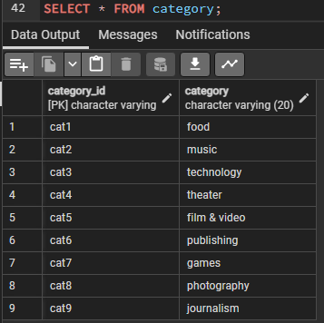
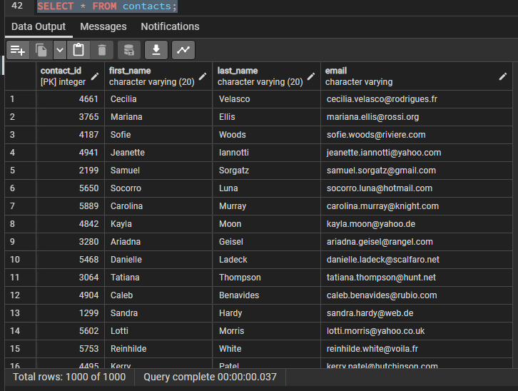
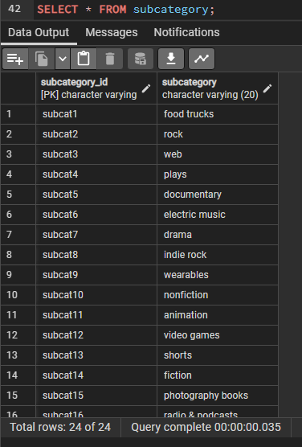

## Crowdfunding ETL Project

This project involves building an ETL pipeline using Python, Pandas, and data extraction techniques to process crowdfunding data. Extracted data is transformed, CSV files are created, and an ERD and table schema are generated. Finally, the data is uploaded into a PostgreSQL database.

### Team Members
- Alejandro Gutierrez
- Jesus Jimenez

### Instructions

1. **Create Category and Subcategory DataFrames**

   - Extract and transform data from `crowdfunding.xlsx` to create the `category` DataFrame.
   - `category` DataFrame should have columns: `category_id` (sequential entries from "cat1" to "catn") and `category`.
   - Export the `category` DataFrame as `category.csv`.

   - Extract and transform data from `crowdfunding.xlsx` to create the `subcategory` DataFrame.
   - `subcategory` DataFrame should have columns: `subcategory_id` (sequential entries from "subcat1" to "subcatn") and `subcategory`.
   - Export the `subcategory` DataFrame as `subcategory.csv`.

2. **Create Campaign DataFrame**

   - Extract and transform data from `crowdfunding.xlsx` to create the `campaign` DataFrame.
   - `campaign` DataFrame should have columns:
     - `cf_id`
     - `contact_id`
     - `company_name`
     - `description`
     - `goal` (float)
     - `pledged` (float)
     - `outcome`
     - `backers_count`
     - `country`
     - `currency`
     - `launch_date` (formatted as "YYYY-MM-DD")
     - `end_date` (formatted as "YYYY-MM-DD")
     - `category_id` (matching `category` DataFrame)
     - `subcategory_id` (matching `subcategory` DataFrame)
   - Export the `campaign` DataFrame as `campaign.csv`.

3. **Create Contacts DataFrame**

   - Extract and transform data from `contacts.xlsx` to create the `contacts` DataFrame.
   - Option 1: Use Python dictionary methods (Convert each row to a dictionary and create a new DataFrame).
     - Split `name` column values into `first_name` and `last_name`.
     - Export the `contacts` DataFrame as `contacts.csv`.
   - Option 2: Use regular expressions (Extract necessary columns using regex and create a new DataFrame).
     - Convert `contact_id` column to integer.
     - Split `name` column values into `first_name` and `last_name`.
     - Export the `contacts` DataFrame as `contacts.csv`.

4. **Create Crowdfunding Database**

   - Sketch an ERD using QuickDBD based on the four CSV files.
   - Create a table schema for each CSV file.
   - Save the database schema as `crowdfunding_db_schema.sql`.
   - Create a new PostgreSQL database named `crowdfunding_db`.
   - Use the schema to create tables in the correct order.
   - Verify table creation with SELECT \* statements.
   - Import CSV files into corresponding SQL tables.
   - Verify data in each table with SELECT statements.
               
     
               
   
            
 
                  
  
               

### Deliverables

- [ETL_Mini_Project_AGutierrez_JJimenez.ipynb](ETL_Mini_Project_AGutierrez_JJimenez.ipynb): Jupyter Notebook containing the code implementation.
- [category.csv](Resources/category.csv): Transformed category data.
- [subcategory.csv](Resources/subcategory.csv): Transformed subcategory data.
- [campaign.csv](Resources/campaign.csv): Transformed campaign data.
- [contacts.csv](Resources/contacts.csv): Transformed contacts data.
- [QuickDBD-export.png](QuickDBD-export.png): ERD of four transformed csv files
- [crowdfunding_db_schema.sql](crowdfunding_db_schema.sql): Table schema for the crowdfunding database.
- [README.md](README.md): Project description and instructions.

Please refer to the `ETL_Mini_Project_AGutierrez_JJimenez.ipynb` file for the complete code implementation and detailed explanations.

